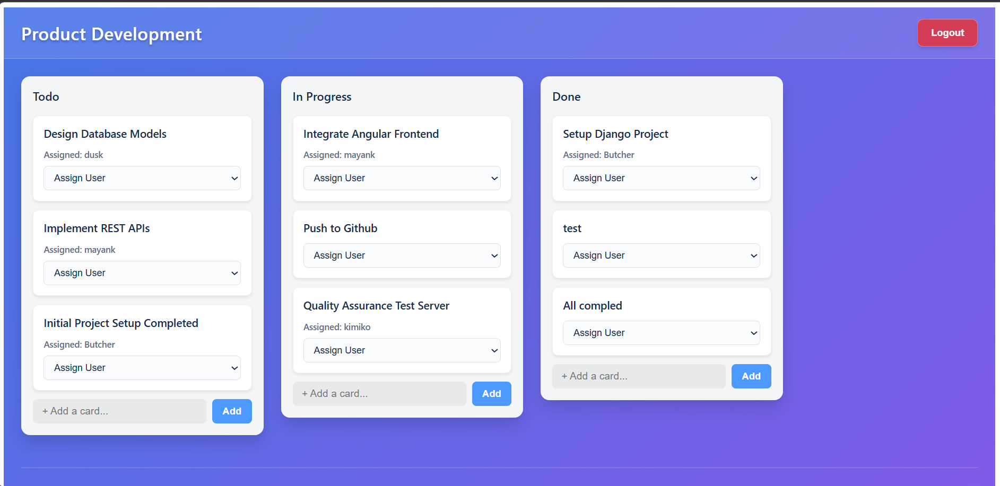
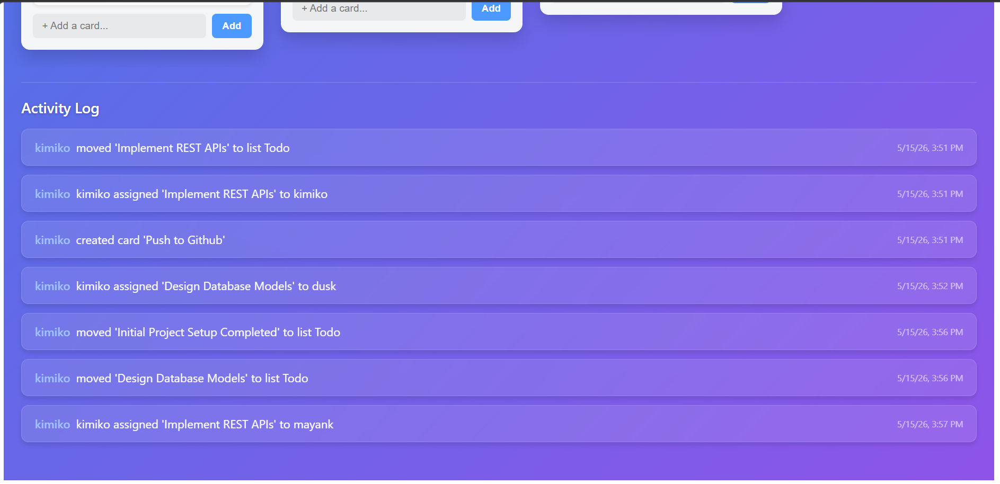

# AsynColl - Asynchronous Collaborative Board 
### Visit Site- https://angular-async-collan.vercel.app/

A full-stack collaborative kanban-style project management application built with **Django REST Framework** (backend) and **Angular 19** (frontend).

## Overview

AsynColl enables teams to collaborate on projects in real-time by organizing tasks into boards, lists, and cards—similar to Trello or Jira. The application provides an intuitive interface for managing workflows and tracking project progress.

## Features

- **Boards**: Create and manage project boards for different projects or teams
- **Lists**: Organize tasks into customizable lists (e.g., To-Do, In Progress, Done)
- **Cards**: Task cards with titles, descriptions, assignments, and positional ordering
- **Card Movement**: Drag-and-drop cards between lists or reorder within lists
- **User Assignments**: Assign cards to team members for better task ownership
- **Optimized Performance**: Advanced query filtering with `prefetch_related` to prevent N+1 database queries
- **RESTful API**: Comprehensive REST API endpoints for all operations

## 📸 Application Snapshot

## Architecture

### Backend
- **Framework**: Django REST Framework
- **Database**: SQLite (configurable for PostgreSQL/MySQL)
- **Python Version**: 3.8+

### Frontend
- **Framework**: Angular 19
- **Build Tool**: Angular CLI
- **Styling**: CSS/Bootstrap

## Data Models

- **Board**: Contains a `name` and belongs to an `owner` (User). The top-level container for all project work.
- **List**: Contains a `name` and belongs to a `board` (Foreign Key). Used to organize cards into workflow stages.
- **Card**: Contains `title`, `description`, `position` (integer for ordering), and belongs to a `list` (Foreign Key). Can be `assigned_to` a User for task ownership.

## 🚀 API Endpoints

All core resources are available under the `/api/` endpoint.

### Boards
| Method | Endpoint | Description |
|--------|----------|-------------|
| GET | `/api/boards/` | List all boards |
| POST | `/api/boards/` | Create a new board |
| GET | `/api/boards/{id}/` | Retrieve a specific board |
| PUT/PATCH | `/api/boards/{id}/` | Update a board |
| DELETE | `/api/boards/{id}/` | Delete a board |

### Lists
| Method | Endpoint | Description |
|--------|----------|-------------|
| GET | `/api/lists/` | List all lists |
| GET | `/api/lists/?board={id}` | Filter lists by board |
| POST | `/api/lists/` | Create a new list |
| GET | `/api/lists/{id}/` | Retrieve a specific list |
| PUT/PATCH | `/api/lists/{id}/` | Update a list |
| DELETE | `/api/lists/{id}/` | Delete a list |

### Cards
| Method | Endpoint | Description |
|--------|----------|-------------|
| GET | `/api/cards/` | List all cards |
| GET | `/api/cards/?list={id}` | Filter cards by list |
| GET | `/api/cards/?board={id}` | Filter cards by board |
| POST | `/api/cards/` | Create a new card |
| GET | `/api/cards/{id}/` | Retrieve a specific card |
| PUT/PATCH | `/api/cards/{id}/` | Update a card (move between lists, change position, etc.) |
| DELETE | `/api/cards/{id}/` | Delete a card |

## Error Handling

The API includes robust validation and error handling:
- Trying to filter by a non-integer ID will return a `400 Bad Request` with a helpful message.
- Trying to filter by an ID that doesn't exist in the database will return a `404 Not Found`.

## Local Development

1. Activate your virtual environment (`AsynBackEnv/Scripts/activate` on Windows).
2. Install requirements: `pip install -r requirements.txt`
3. Run migrations: `python manage.py migrate`
4. Start the server: `python manage.py runserver`
